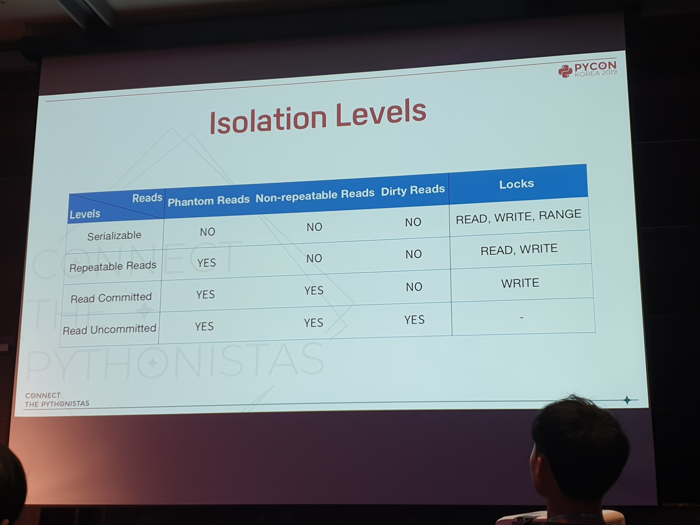
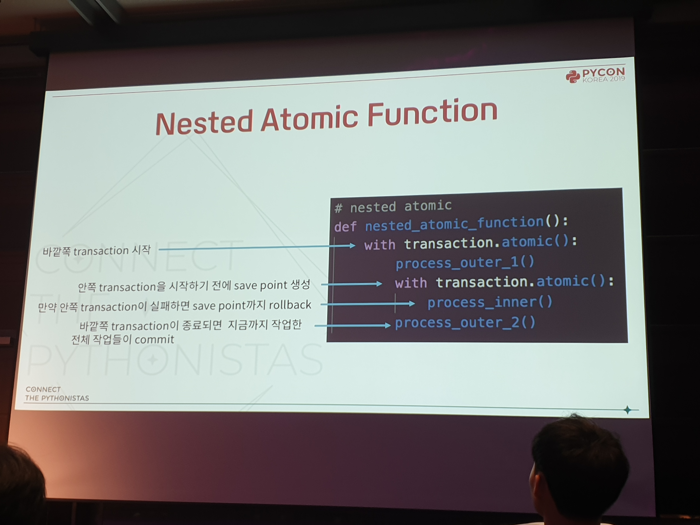
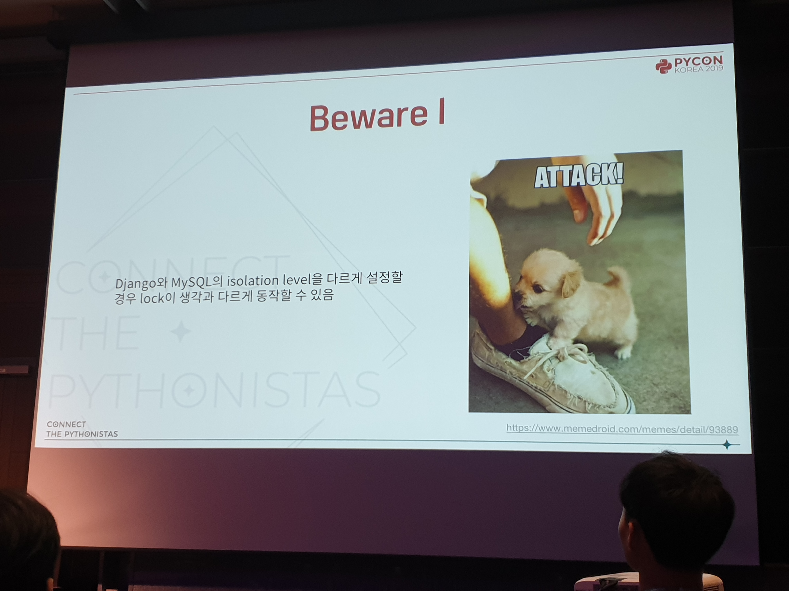
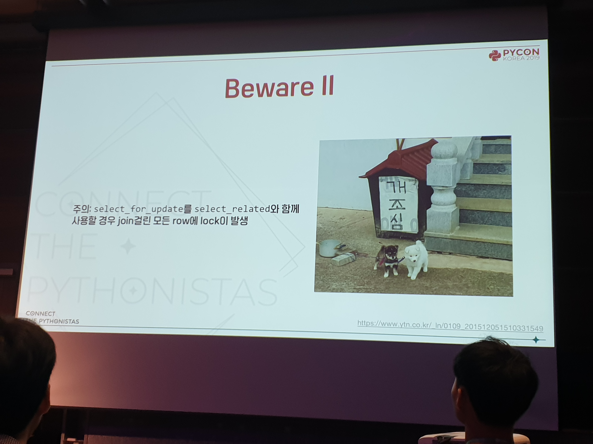
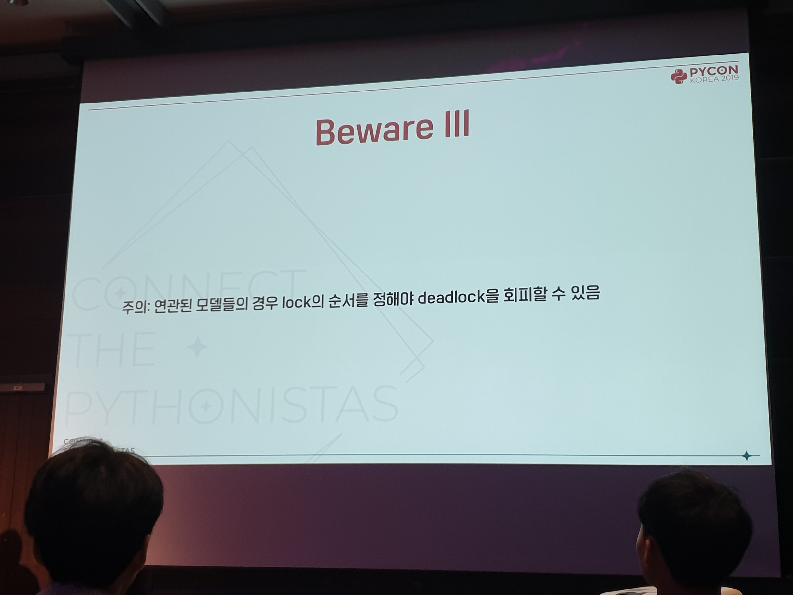
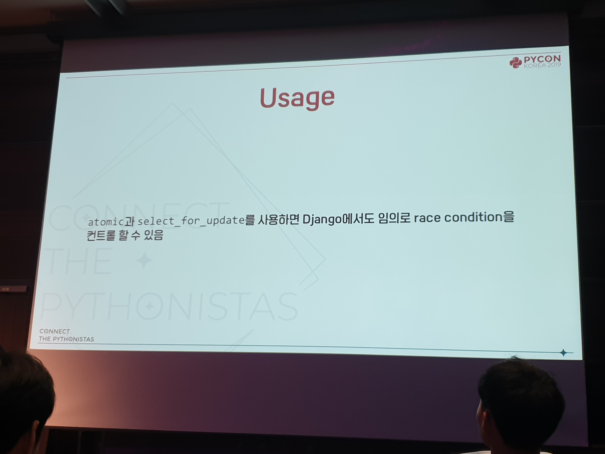
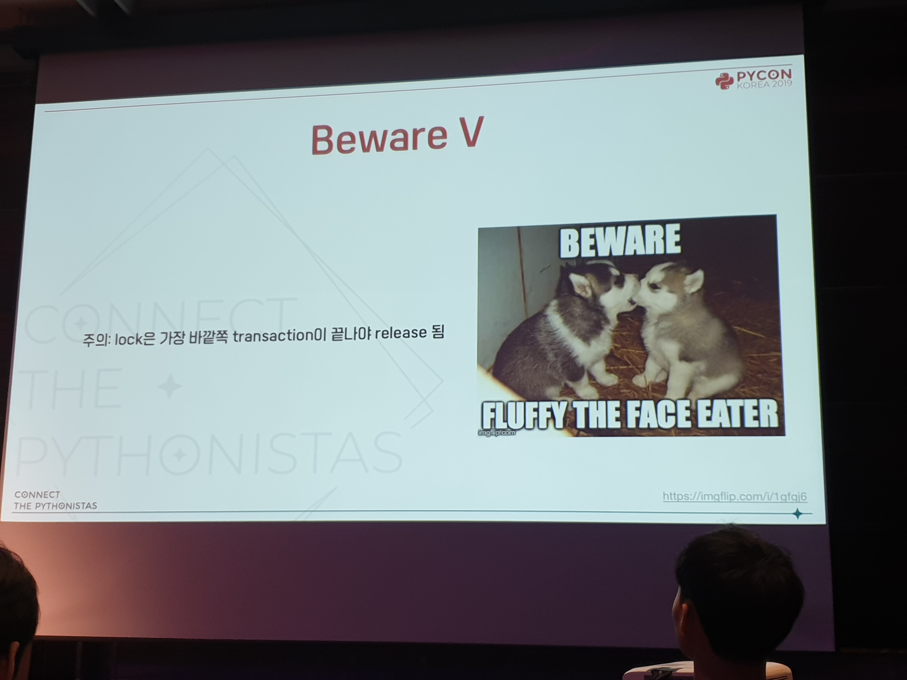
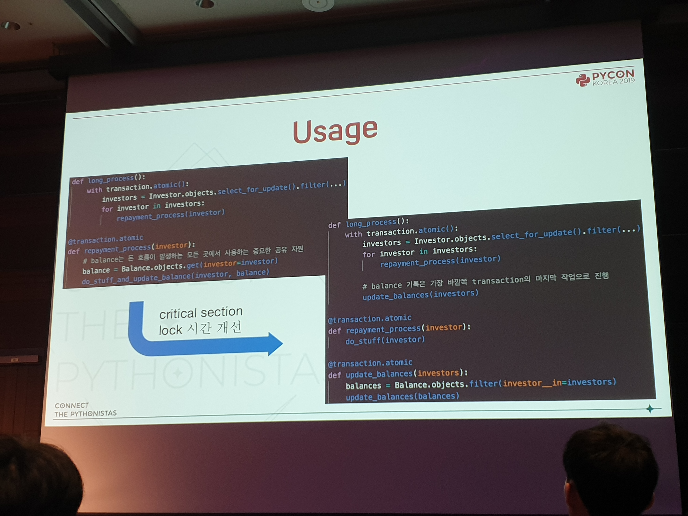

Multitasking 환경을 상대하기 위한 DB의 특성과 그런 DB를 상대하기 위한 Django - 문석환 [#](https://www.pycon.kr/program/talk-detail?id=66)
---

* ACID
    * atomicity
        * transaction의 모든 작업이 반영되거나 롤백됨
    * consistency 
        * 미리 정해진 규칙에 따라서만 데이터가 수정 
    * isolation 
        * 특정 트랜젝션에서 다른 트랜젝션에서 보여지는 정도
        * 정도를 조절하기 위해 lock 사용
    * duration
        * 한번 반영된 transaction은 영구히 반영

* lock
    * write lock
        * 같은 데이터에 write/read를 시도하는 다른 트랜젝션을 block
    * read lock
        * 같은 데이터에 write를 시도하는 다른 트랜젝션만 block
    * Two Phase Locking Protocol
    * 병렬 작업 불가
    * 잘못된 사용 시 데드락

* 읽기 현상
    * dirty read
    * non repeatable read
        * 두번의 같은 쿼리가 다른 결과 반환
    * Phantom read
        * 두번의 같은 쿼리가 다른 row 반환

Django는 디비 쿼리가 발생할 때 statement 생성\
Statement 생성 시마다 commit\

너무 많이 사용시 lock timeout\
피하려면 프로세스들이 lock을 들고 있는 시간 최소화

