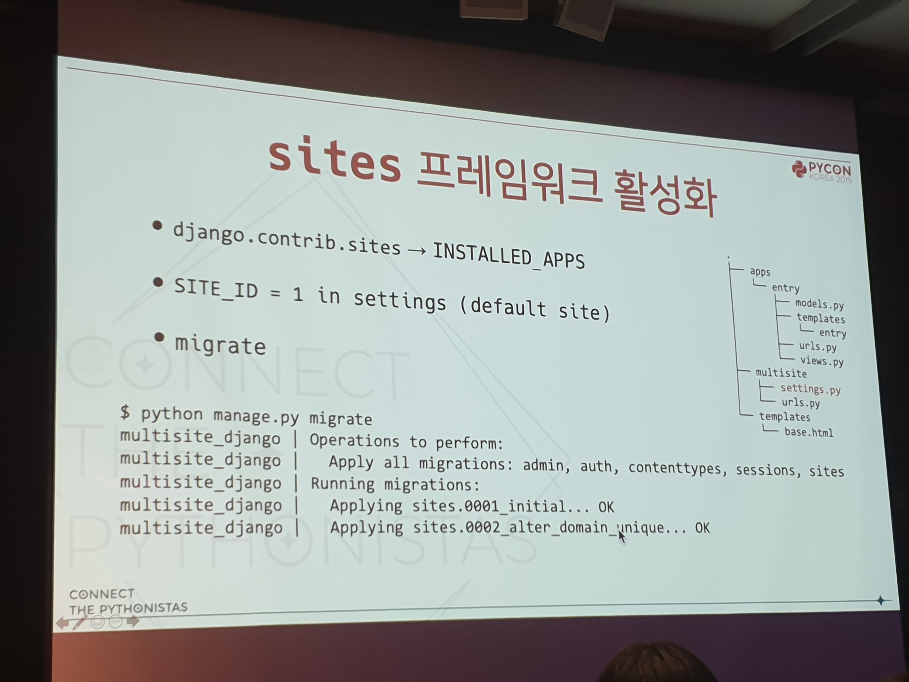
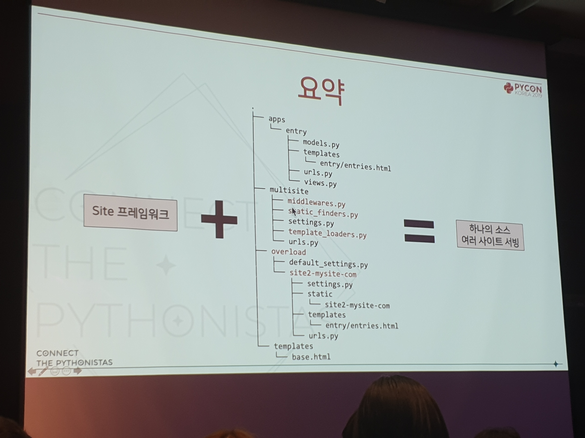

[< Go Back](../index.md)

하나의 Django 코드로 여러 사이트 운영하기 - 박종현 [#](https://www.pycon.kr/program/talk-detail?id=135)
---

기본 뼈대는 동일하지만 다른 내용의 서비스가 필요한 경우\
\
Site 프레임워크
* Django에 내장
* DB 수준에서 사이트 지정
* 웹사이트의 domain과 name을 지정
* 모델 방식으로 사용

Django 미들웨어 사용\
  __call__이라는 메소드 정의 필요\
  \
설정 및 URL 불러오기\
  도메인에 맞춰 모듈 가져옴\
\
템플릿 불러오기\
  multisite.template_loaders.MultiSiteLoader 이용\
\
리소스 불러오기\
  multisite.static_finders.MultiSiteLoader 이용\
\
요약:\

근데 내 생각에 이거 노드로도 될 것 같아
