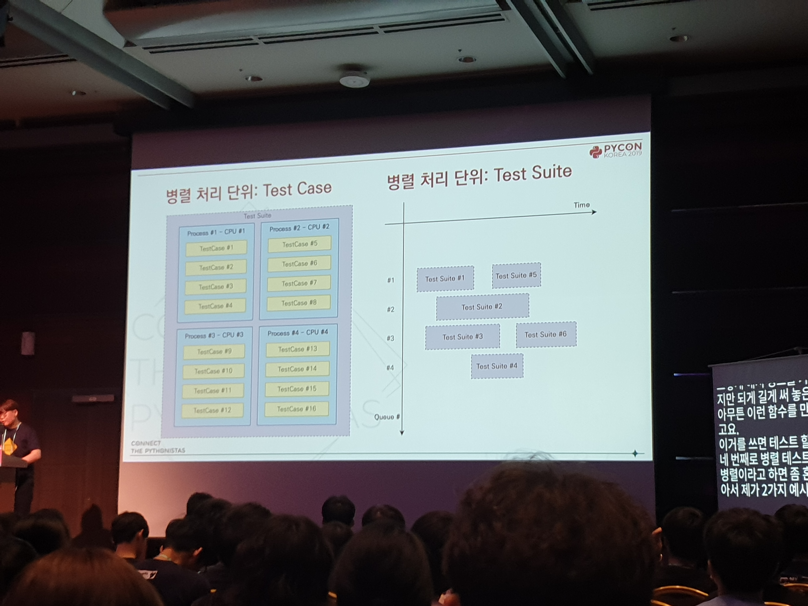

테스트에 걸리는 시간을 \*92%\* 줄이기 - 구영민 [#](https://www.pycon.kr/program/talk-detail?id=67)
---

User Create
---
* 유저 100개 만드는 테스트하는데 20초가 걸림
* 왜? Django에서 비밀번호 해싱이 너무 오래 걸림
* 키 스트레칭이 문제. 한 유저에 0.2초 걸림
* 그래서 테스트 환경에서만 MD5(...)로 바꿔 사용

Mocking
---
* 테스트에서는 요청에 따른 기다림이 불필요함
* 그래서 모킹을 해줌
* 근데 실제로 쉬지 않으니까 오류가 터짐
* 이 때 [freezegun](https://github.com/spulec/freezegun)이라는 라이브러리를 사용

TransactionTestCase를 사용하지 마세요
---
* 테스트는 다른 테스트에서 영향받지 않아야 함
* 그래서 삭제를 해야함
* TestCase는 테스트가 끝나면 DB를 롤백
* TransactionTestCase는 뭔가 씀
* TransactionTestCase는 3000배 가까이 느림
* DB Lock 관련 로직은 transaction 내부에서 실행되지 않을 경우 오류를 던지므로 테스트 중요
* on_commit으로 오류 시 롤백 대비 가능
* on_commit은 TransactionTestCase사용
* validate no atomic 뭐시기를 mock하면 TestCase 사용 가능

병렬 테스트
---

* 장고 1.9 이후부터는 별도 설정 없이 사용 가능
* 1.11 이하에서는 이상한 오류가 뜰 수 있음
* 장고의 병렬 테구트는 마스터 프로세스에서 워커 프로세스의 이벤트 객체를 가져옴
* DoesNotExist 등등은 pickle이 안됨
* 근데 2.1 이상에서는 고쳐져있음.
* 그래서 2.1에 적용된 패치를 1.11로 가져옴
* 불안정할 수 있으므로 테스트 환경에서만 사용

Keepdb with mysqldump
---
* Django Keepdb는 최초 테스트 데이터베이스를 재활용
* 다음 테스트에서는 추가된 마이그레이션만 수행
* 근데 git-flow에서는 여러개의 피쳐 브랜치가 같은 데이터베이스를 공유
* 그래서 문제가 터짐
* 그래서 덤프를 떠놓음
* ???
* 굉장한 시간 절약!!

Python Linter
---
* 좋죠. 좋기는 한데
* 오버헤드가 너무 큼. 무한 루프도 뜸
* 그래서 안씀
* 근데 또 안쓸수는 없네?
* 그러니까 필요할 때만 사용

개발팀 내에서의 변화
---
* 테스트 깨지면 릴리즈 프로덕션 배포 안함
* 조급하게 되지도 않음
