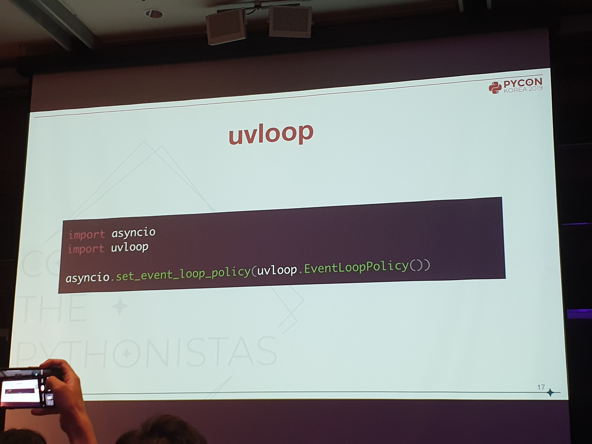
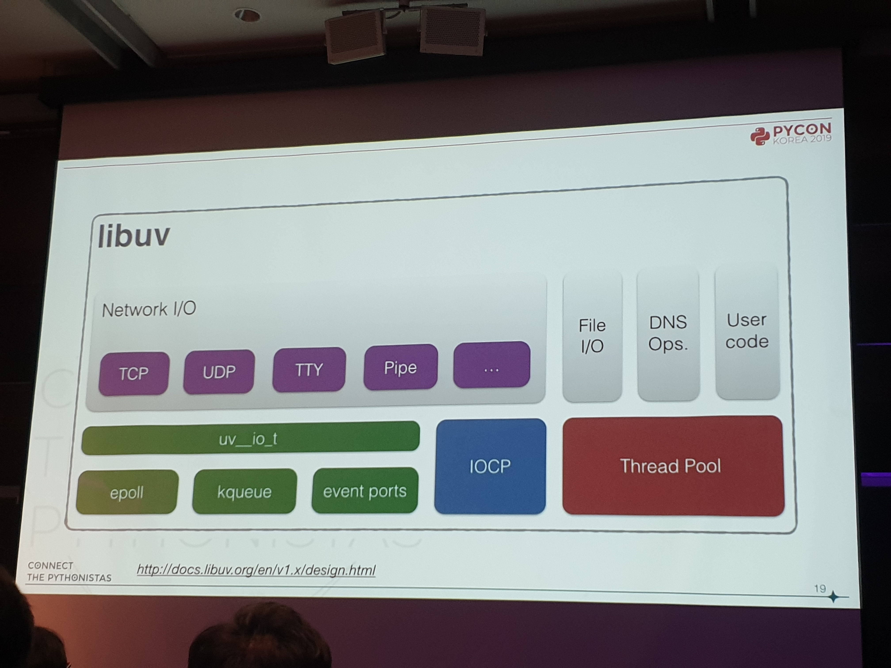
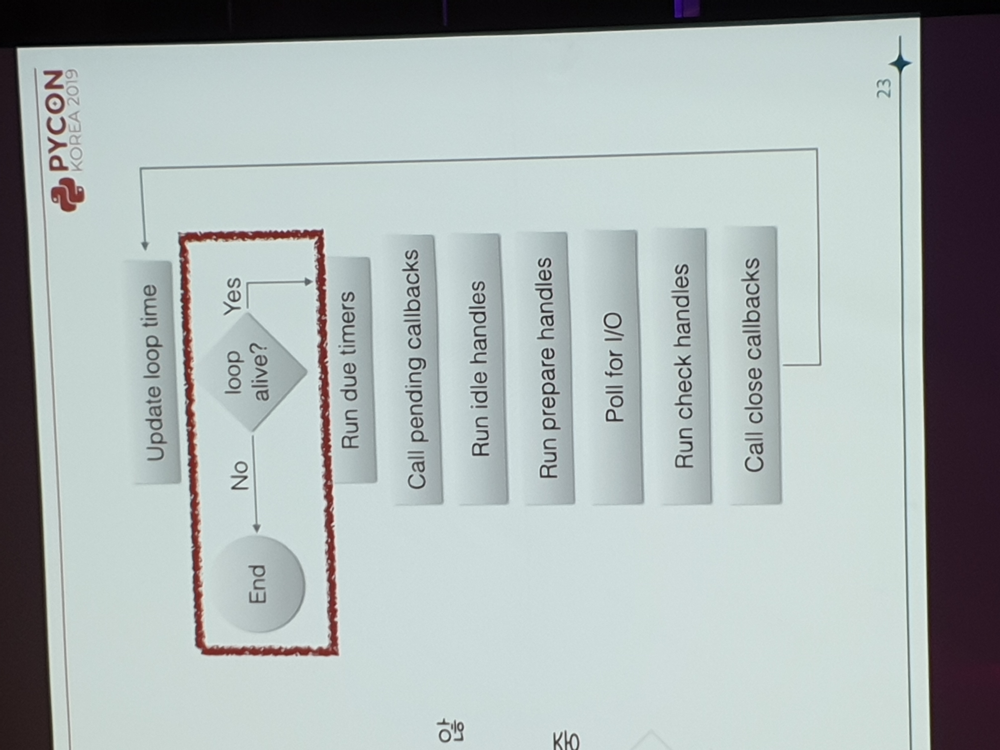
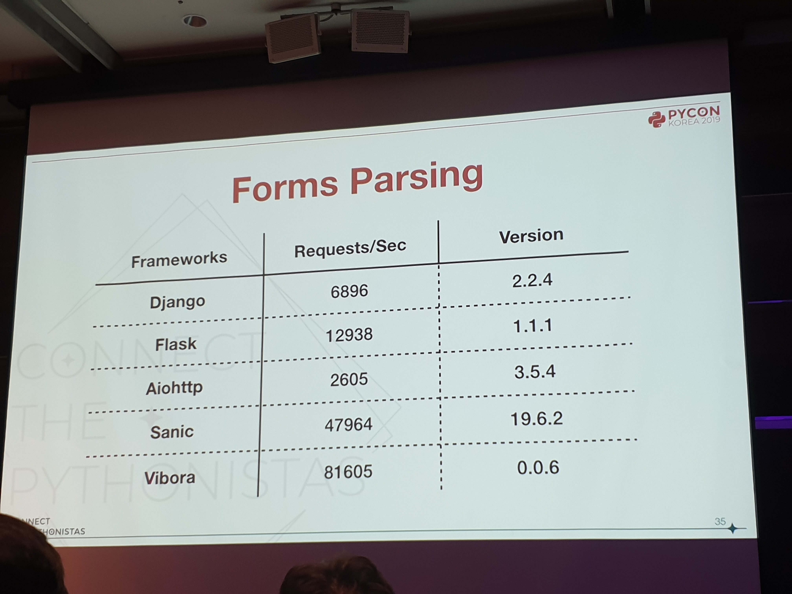
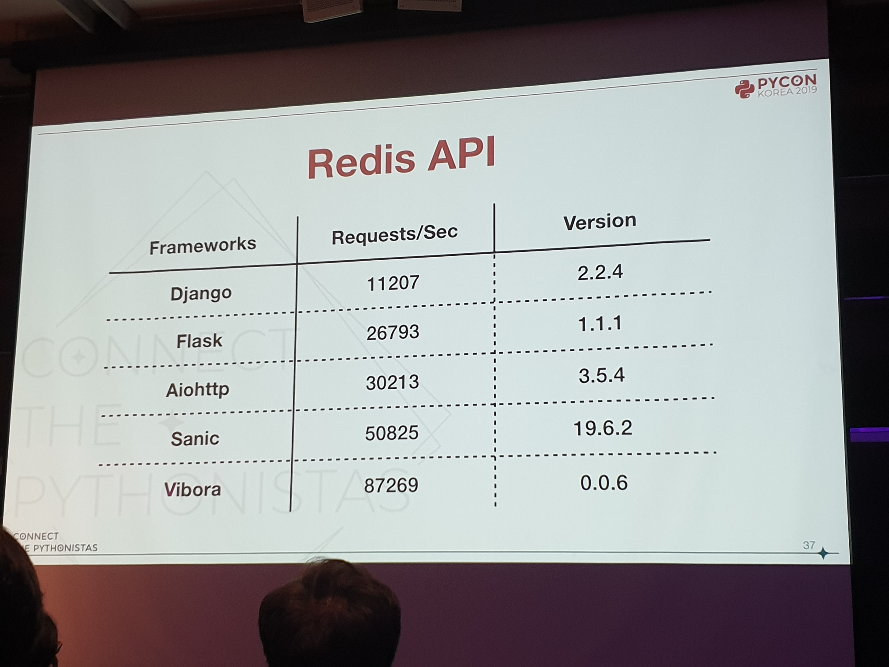
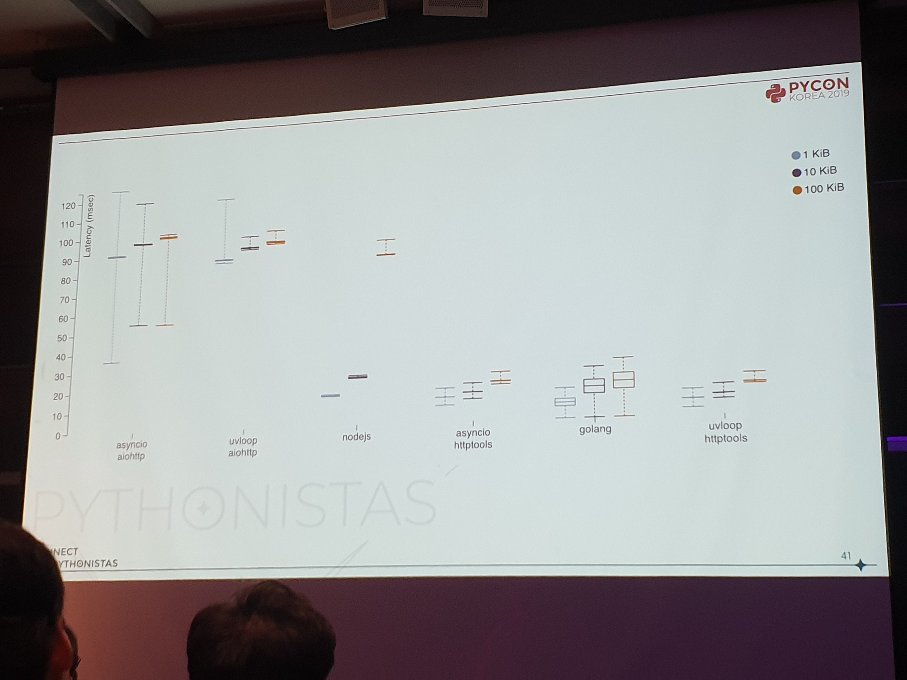

파이썬으로 서버를 극한까지 끌어다 쓰기: Async I/O의 밑바닥 - 한섬기 [#](https://www.pycon.kr/program/talk-detail?id=90)
---

프레임워크들
---
* [Quart](https://gitlab.com/pgjones/quart)
* [Growler](https://github.com/pyGrowler/Growler)
* [FastAPI](https://github.com/tiangolo/fastapi)
* [Vivora](https://github.com/vibora-io/vibora)
    * Flask와 유사
    * 속도 위주
    * 멀티 프로세스
    * 가능한 경우, uvloop과 C로 구현한 방식을 사용
* [aiohttp](https://github.com/aio-libs/aiohttp)
    * asyncio 사용하는 비동기 HTTP 클라이언트이자 서버 프레임워크
    * 서버와 클라이언트 웹소켓 둘 다 지원
    * 웹서버는 미들웨어와 시그널 제공
* [Sanic](https://github.com/huge-success/sanic)
    * 높은 성능의 HTTP 서버
    * 확장성 목표
    * 클래스 기반의 뷰
    * 블루프린트 서브 라우팅
    * uvloop 비동기
* [Tornado](https://github.com/tornadoweb/tornado)
    * 웹 프레임워크, 비동기 네트워크 라이브러리
    * 클라이언트, 서버 제공
    * 코루틴 라이브러리인 tornado.gen과 yield 문법으로 비동기 구현

라이브러리들
---
* [asyncio](https://docs.python.org/ko/3/library/asyncio.html)
    * async await을 사용해 동시성 코드 작성
    * 고수준 API 집합 제공
    * 저수준도 제공
* [uvloop](https://github.com/MagicStack/uvloop)
    * asyncio의 이벤트 루프 대체
    * Cython으로 구현, libuv 기반

* [libuv](https://github.com/libuv/libuv)
    * unicorn velociraptor library
    * Node.js를 위해 작성
    * 크로스플랫폼 지원
    * 이벤트 드리븐 비동기 I/O 모델 기반
    * kqueue epoll IOCP 등을 추상화

    * 각각 다른 스레드에서 여러 이벤트 루프 가능

성능 차이
---

Asyncio vs uvloop
---
* uvloop
    * Cython과 C로 작성
    * 파이썬 객체을 C로 구현(?)
    * 메모리 관리 최적화
    * 시스템 자원 사용 최적화

* 실제 성능은 유사(???)

Django X async
---
* Django 3.0에서 ASGI와 함께 동작할 수 있는 완전한 비동기 지원
* 2019년 12월 배포 예상
* 동기 방식 코드 그대로 사용 시 SynchronousOnlyOperation 에러
