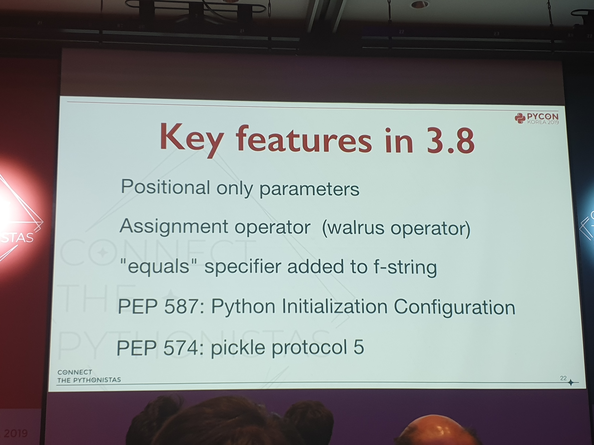
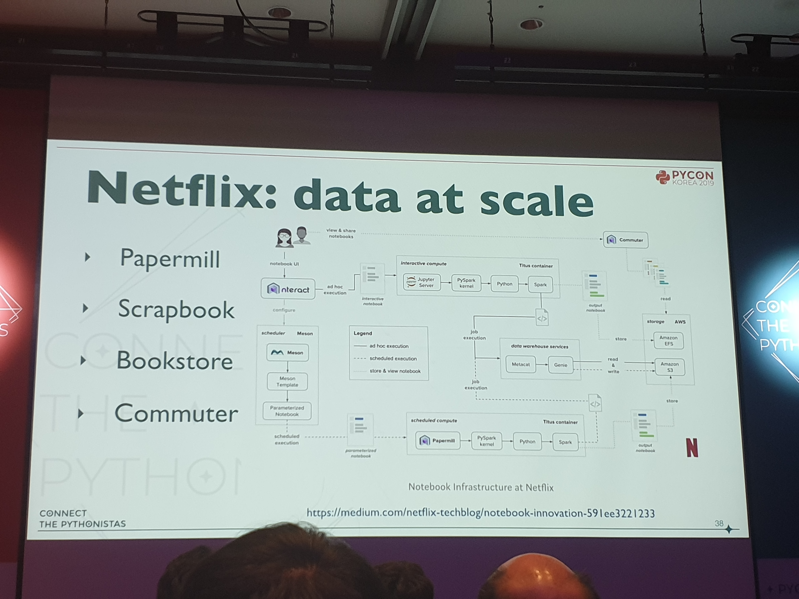
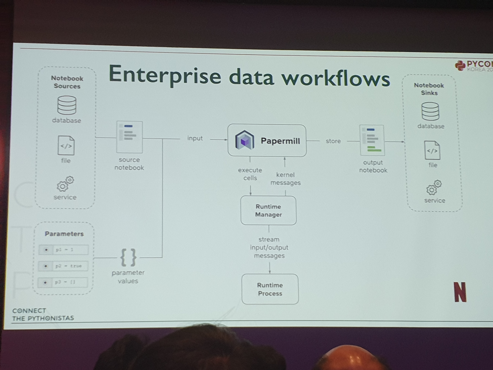
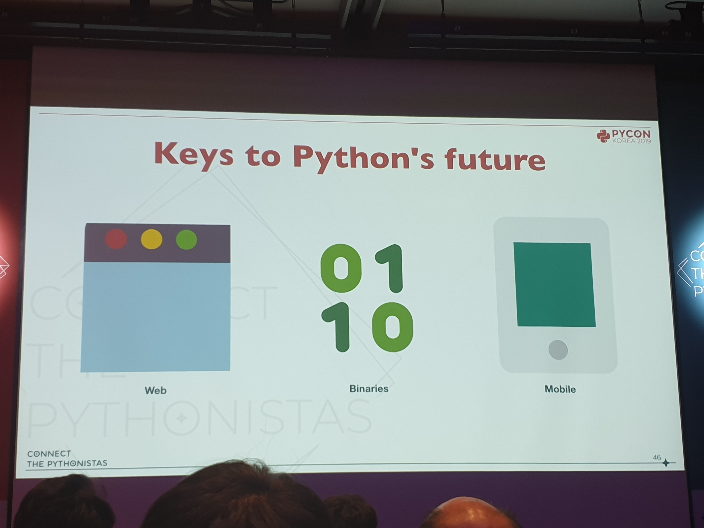
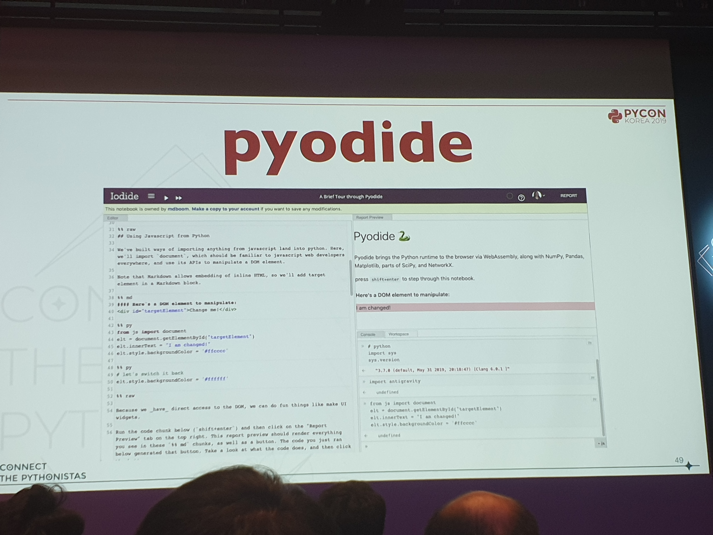
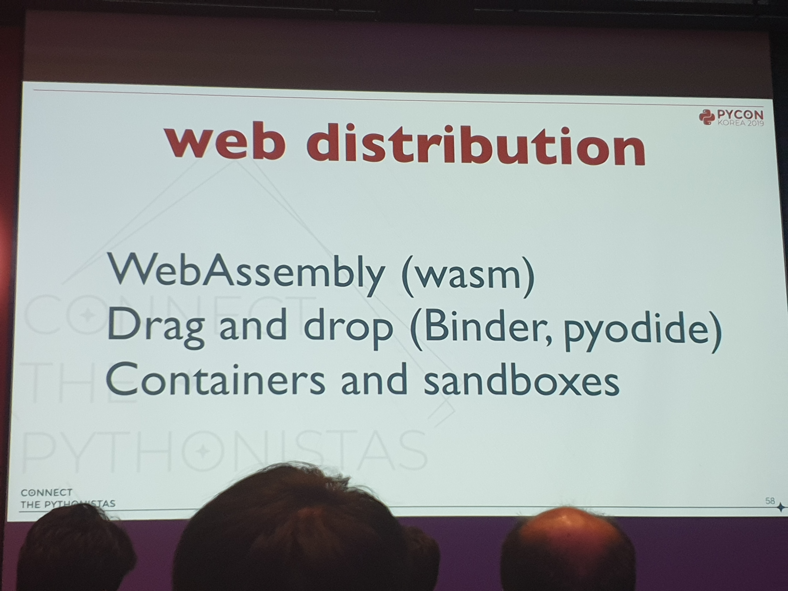
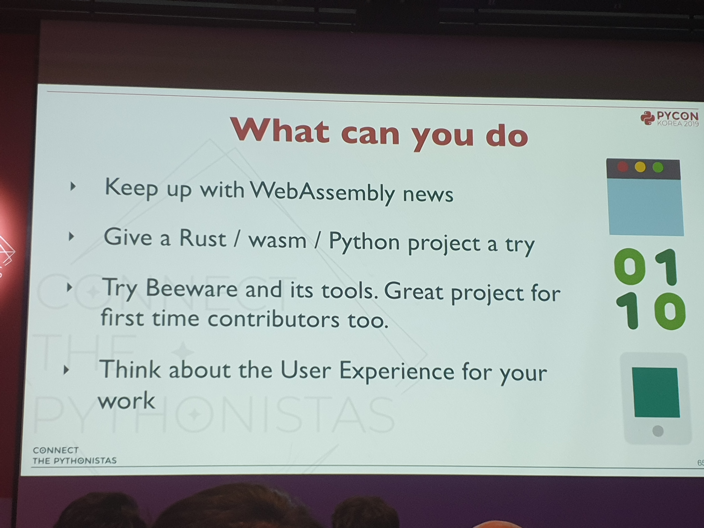
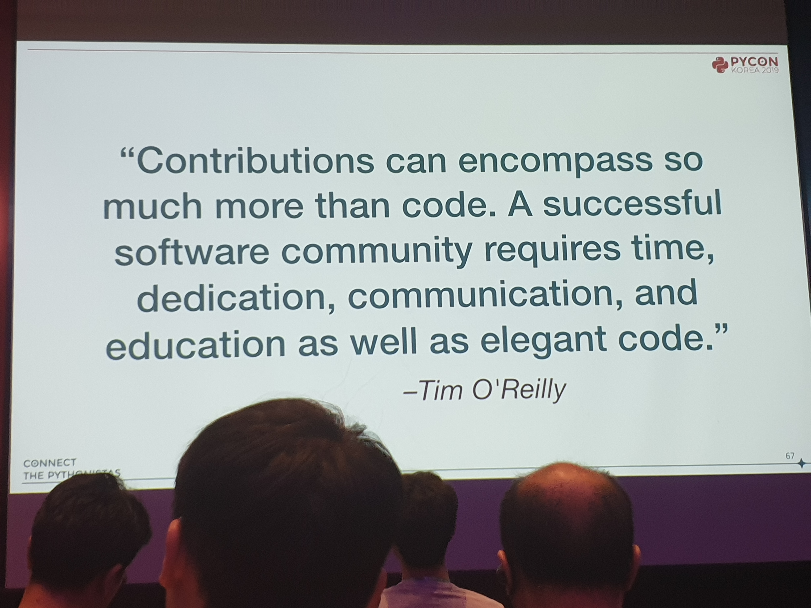
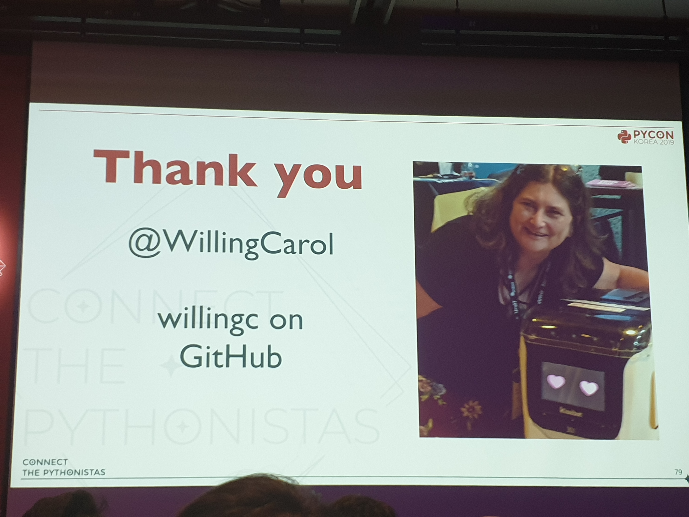

The State of Python - Carol Willing 님 키노트 [#](https://www.pycon.kr/program/talk-detail?id=153)
---

파이썬의 현재
---
변화는 영구적이다. 두려울 수는 있으나 기회가 될 수도 있다.\
좋은 코드는 소통으로 만들어진다.\
파이썬의 용도는 늘어나고 있다. 웹, 시스템 프로그래밍부터 과학 등등까지.

파이썬 2가 2020년 1월 1일에 지원 종료된다. [#](http://pythonclock.org)

코드로 소통하기
---
jupyter
* 웹을 인터페이스로 사용함을 통해 접근성을 높임

nteract

* 페이퍼밀을 통해 워크플로우를 간략화 가능\

binder
* 깃 리포지토리 가져와서 쿠버네티스 올려서 돌려줌

파이썬의 미래로 향하는 열쇠
---

웹에서 일어나는 일
* JS와 웹어셈블리의 파이썬과의 인터렉트
* 
(jupyter에서 3d를 보게 해준다고?)\
(애니메이션까지 넣어준다고?)

실행 파일
* 쉬운 실행
* 크로스플랫폼
* 웹 배포?

모바일
* 주피터허브 - 브라우저만 있으면 됨\
* binder - 폰으로만 짠것도 있다고?\

내가 뭘 할수 있는가\

코드와 커뮤니티
---

* 존중 - 시간, 품위 있는 의견 충돌, 내 시도가 최선이 아닐수도
* 듣기 - 이해, 고려, 타인의 가치있는 아이디어
* 공유 - 경험, 지식, 리스크와 보상
* 믿음 - 부정은 창의성을 죽임
* 겸손 - 혁신, 실패로부터 배운다, long-term success
* 강한 비전을 가져라

